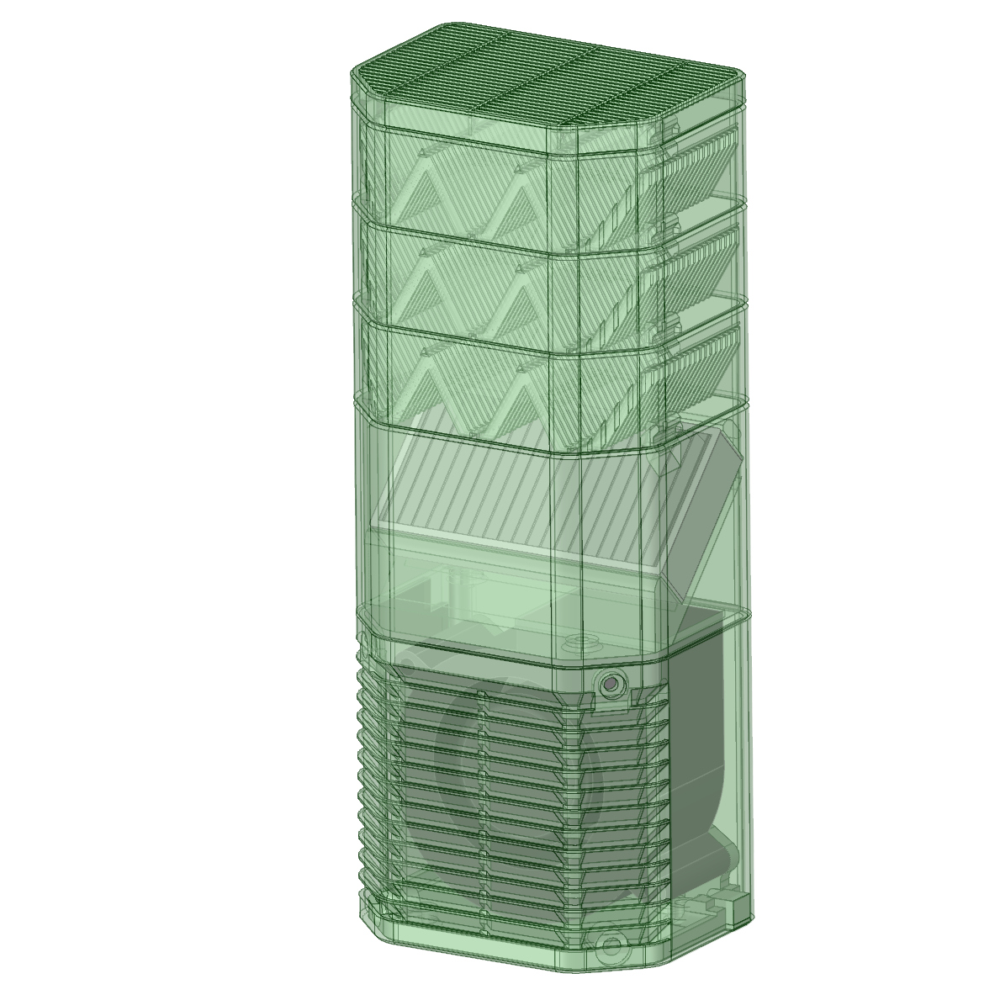
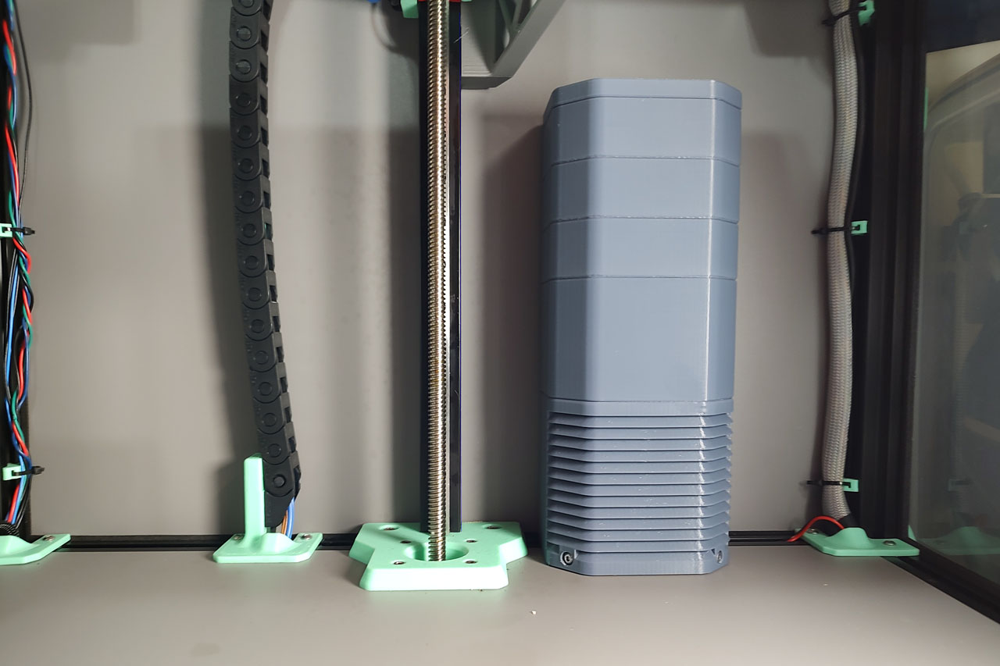

# Activated Carbon Filter 7530 for VORON TRIDENT

 

## Feature
- Built-in Hepa filter removes floating microplastics.
- 3-layer activated carbon filter

## BOM
- M3 x 10mm SHCS x6
- M3 x 35mm BHCS x2
- M3 Insert Nut x6
- M3 Roll-in T-nut x2
- 75x30 Blower Fan Gdstime GDB7530(24V) x1
- JST-XH 2pin Connector x1 set  
- 80mm x 40mm x 15mm hepa filter x1
